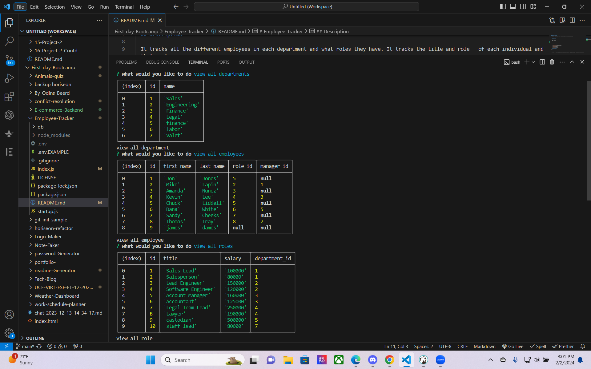
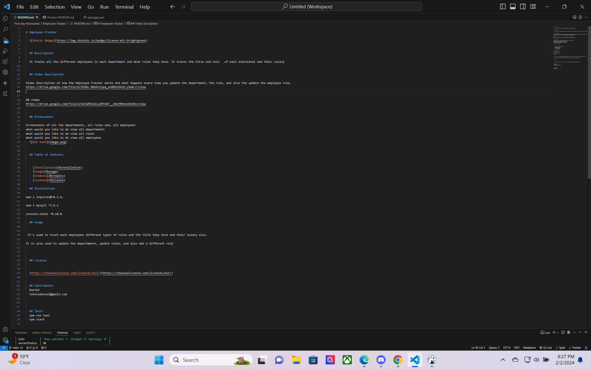

# Employee-Tracker
  
  
    

  ## Description
  
  It tracks all the different employees in each department and what roles they have. It tracks the title and role   of each individual and their salary

  ## Video Description 

Video description of how the Employee-Tracker works and what happens every time you update the department, the role, and also the update the employee role.
https://drive.google.com/file/d/1h9GL-RmV4LFopq_enGDVsZVzE-ySwA-C/view

DB video
https://drive.google.com/file/d/1mTaMJ6JeLyURYuRr__64yYN5mcU2m3Ko/view

  ## Screenshots 

Screenshots of all the departments, all roles and, all employees
what would you like to do view all departments
what would you like to do view all roles
what would you like to do view all employees
  
  
README.MD screenshot 

  ## Table of Contents 
  
  
  - [Installation](#installation)
  - [Usage](#usage)
  - [Credits](#credits)
  - [License](#license)
  
  ## Installation
  
npm i inquirer@^8.2.6,

npm i mysql2 ^3.9.1

console.table ^0.10.0
  
  ## Usage
  
  
 It's used to track each employees different types of roles and the title they have and their salary also.

It is also used to update the departments, update roles, and also add a different role 
  
  
  
  ## License
  

  [https://choosealicense.com/licenses/mit/](https://choosealicense.com/licenses/mit/)

  
  ## Contributor
  Daniel 
  tekoladaniel@gmail.com

  
  
  ## Tests
  npm run test
  npm start 
